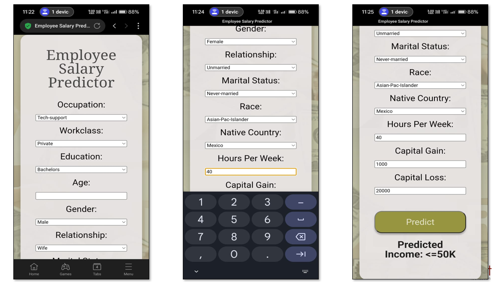

# 💼 Employee Salary Predictor

An AI-powered web application that predicts whether an employee’s income exceeds \$50K annually, based on demographic and employment data from the UCI Adult dataset. Built with a Gradient Boosting Classifier, Flask, and a custom HTML/CSS frontend, and deployed on Render.


## Live Demo

Check it out: https://employee-salary-predictor-vo4z.onrender.com


## Project Overview

- Utilizes the **UCI Adult Income** dataset, which contains demographic and employment features.
- Preprocesses data using encoding and scaling.
- Trains a **Gradient Boosting Classifier** achieving **87% accuracy**.
- Frontend prototype designed in **Figma**, implemented using **HTML** and **CSS** with custom fonts.
- Backend integration using **Flask** to handle inputs/outputs in real-time.
- Hosted publicly via **Render** for cross-device access.


## Features

-  Dynamic form for user input with validation  
-  Accurate classification into `<=50K` or `>50K` income brackets  
-  Responsive UI with custom fonts and backgrounds  
-  Secure model deployment and serialization using `joblib`

## Dataset

- Source: [UCI Adult Income Dataset](https://archive.ics.uci.edu/ml/datasets/adult)
- Includes attributes like:
  - Age, Education, Gender
  - Occupation, Marital Status, Hours per week
  - Capital gain/loss, Native country, etc.


## Tech Stack

| Area             | Technologies Used                  |
|------------------|------------------------------------|
| ML Model         | Python, Scikit-learn, Pandas       |
| Preprocessing    | Label Encoding, OneHot, Scaling    |
| Frontend         | HTML5, CSS3, Figma (UI Design)     |
| Backend          | Python Flask                       |
| Deployment       | Render                             |
| Model Storage    | Joblib (.pkl files)                |

## Installation

### Prerequisites

- Python 3.7+
- Git

### Run Locally

1. Clone the repository  
   ```bash
   git clone https://github.com/your-username/employee-salary-predictor.git
   cd employee-salary-predictor
   
2. Create virtual environment and activate
   ```bash
   python -m venv venv
   source venv/bin/activate  # or venv\Scripts\activate (Windows)
   
4. Install dependencies
   ```bash
   pip install -r requirements.txt
   
6. Run the Flask app
   ```bash
   python app.py
   
📌 Then visit http://127.0.0.1:5000 in your web browser.

## Repository Structure
      ```cpp
      ├── app.py
      ├── gbc_model.pkl
      ├── scaler.pkl
      ├── model_columns.pkl
      ├── requirements.txt
      ├── Procfile
      ├── templates/
      │   ├── index.html
      │   └── predict.html
      └── static/
          ├── css/
          │   ├── globals.css
          │   └── predict.css
          ├── fonts/
          │   ├── AlfaSlabOne-Regular.ttf
          │   └── AlbertSans-Regular.ttf
          └── images/
              └── bg2.png
## 💻 User Interface Preview

### Home Page


### Prediction Page


### Output Result


### Mobile View


## Results Summary

- Model Accuracy: 87%
- Live Verdict: Real-time salary classification accessible via web app
- Frontend Design: Figma → HTML/CSS prototype successfully implemented
- Cross-Device Support: Desktop and mobile friendly

### Model Performance


## Author
Rakksitha R<br>
AI & ML Enthusiast | Student @ Sona College of Technology<br>
📬 https://www.linkedin.com/in/rakksitha-r-85a3b031a<br>

## License
This project is open-source and free to use for educational purposes.

